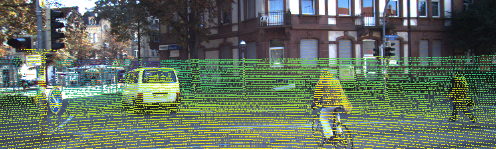

# Generate Depthmaps from KITTI data in C++



## Installation

### Dependencies

* CMake 3.0 or newer
* Eigen 3.0 or newer
* OpenCV 4.0 or newer

### Building from source

```bash
mkdir build
cmake ..
make
```

## Usage

```bash
./build/bin/kitti-depthmap [cloud_location] [image_location] [velo2cam_calib_location] [cam2cam_calib_location]
```